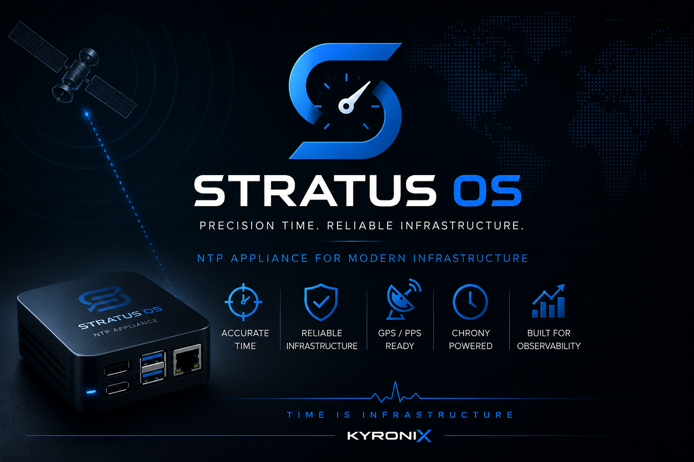

# Stratus OS v1.0


<p align="center">
  <strong>Secure, minimal and observable NTP appliance OS for Raspberry Pi.</strong>
</p>

<p align="center">
  Built by <strong>Kyronix</strong> for reliable time infrastructure, homelabs, labs and isolated networks.
</p>

<p align="center">
  <a href="https://ko-fi.com/X8X31QYP4A">
    
  </a>
</p>

<p align="center">
  
  
  
  
  
  
</p>

---

## 🕒 What is Stratus OS?

**Stratus OS** is a minimal, hardened ARM64 Linux appliance designed for **secure and deterministic time infrastructure**.

It turns a Raspberry Pi into a dedicated **NTP appliance** powered by **chrony**, with optional **GPS/PPS** support for Stratum-1 deployments.

The goal is simple:

> Time infrastructure should be reliable, visible and easy to operate — not a silent background service you only notice when it breaks.

---

## 🚀 Why it exists

Most environments depend on time synchronization, but NTP is often treated as invisible infrastructure.

That becomes a problem when:

- clocks drift silently,
- upstream time sources become unstable,
- logs no longer correlate correctly,
- authentication and certificates behave unexpectedly,
- monitoring systems miss early timing degradation.

**Stratus OS** is built to make time infrastructure more predictable, controlled and appliance-like.

---

## ✨ Features

- 🕒 Dedicated NTP appliance OS
- ⚙️ Chrony-based time service
- 🛰️ Optional GPS/PPS support
- 🔒 Minimal attack surface
- 🚫 No desktop, no web UI, no unnecessary services
- 🧱 Appliance-style filesystem and service layout
- 🧼 Deterministic boot and predictable operation
- 💾 Universal ARM64 SD card image for Raspberry Pi
- 🛠️ Designed for labs, homelabs, SOC and isolated networks

---

## 🧱 Architecture

### Logical time topology

```text
        ┌──────────────┐
        │   GPS / PPS  │
        │  Reference   │
        └──────┬───────┘
               │
        ┌──────▼───────┐
        │  Stratus OS  │
        │   chrony     │
        │  Stratum-1   │
        └──────┬───────┘
               │
     ┌─────────▼─────────┐
     │ Internal Network  │
     │ Servers / Clients │
     └───────────────────┘
```

---

### ⚙️ System profile
| Component       | Details                     |
| --------------- | --------------------------- |
| Architecture    | ARM64 / AArch64             |
| Target hardware | Raspberry Pi 3 / 4 / 5      |
| Init system     | systemd                     |
| Time daemon     | chrony                      |
| Management      | SSH                         |
| UI              | None                        |
| Package scope   | Minimal appliance userspace |
| Storage         | 8 GB+ SD card               |

---

## 🔧 Included services

| Service   | Purpose                      |
| --------- | ---------------------------- |
| `chrony`  | NTP server / client          |
| `sshd`    | Remote management            |
| `systemd` | Boot and service supervision |

---

## 🔐 Security model

Stratus OS follows a **minimal, deny-by-default appliance model**.

### Implemented

- Minimal userspace
- No desktop environment
- No web services
- SSH-only management
- No general-purpose server role
- Deterministic service startup
- Predictable filesystem layout

### Recommended after deployment

- Change the default password immediately
- Replace or rotate SSH keys
- Restrict SSH to a management VLAN
- Disable password authentication
- Allow NTP only where needed
- Firewall UDP/123 based on your network design
- Use GPS/PPS only on trusted hardware

---

## 💾 Flashing the image

### Linux / macOS

```bash
gunzip -c stratus-os-v1.0-arm64.img.gz | sudo dd of=/dev/sdX bs=4M status=progress conv=fsync
```

Replace `/dev/sdX` with your actual SD card device.

> Be careful: using the wrong device path can overwrite another disk.

---

## 🔑 First login

Default access:

```text
User: root
Password: admin
```
Change the password immediately after first boot:
```bash
passwd
```
---

## 🧰 Recommended hardware

- Raspberry Pi 3 / 4 / 5
- 8 GB SD card minimum
- Wired Ethernet recommended
- Optional GPS module with PPS output
- Stable power supply
- Optional case with cooling

---

## 📦 Use cases

- Enterprise internal time authority
- Homelab NTP appliance
- SOC and lab environments
- Air-gapped or isolated networks
- OT / industrial test networks
- Stratum-1 GPS/PPS node
- Stratum-2 internal relay node

---

## 📊 Observability direction

Stratus OS is designed to evolve toward observable time infrastructure.

Planned areas include:

- chrony health checks
- GPS/PPS status visibility
- Prometheus metrics
- Grafana dashboards
- drift and degradation detection
- appliance health reporting

```text
chrony → metrics → dashboards → health signals → operator action
```

---

## ⚠️ Known limitations

Current v1.0 limitations:

- No web UI
- No OTA update system
- No automatic GPS/PPS detection yet
- Single-purpose appliance only
- Manual post-flash configuration may be required

---

## 🤝 Contributing

Stratus OS follows a **controlled appliance model**.

Suggestions, issues and discussions are welcome through **GitHub Issues**.

Good contribution areas:

- Documentation improvements
- Hardware compatibility notes
- GPS/PPS module testing
- chrony configuration examples
- Monitoring and dashboard ideas

---

## 📄 License

Licensed under the **MIT License**.

---

## 🧭 Project

Built by **Kyronix**.

Stratus OS is part of a broader infrastructure lab focused on:

- Secure time services
- Observability
- Internal infrastructure
- Automation
- Resilient operations
     
